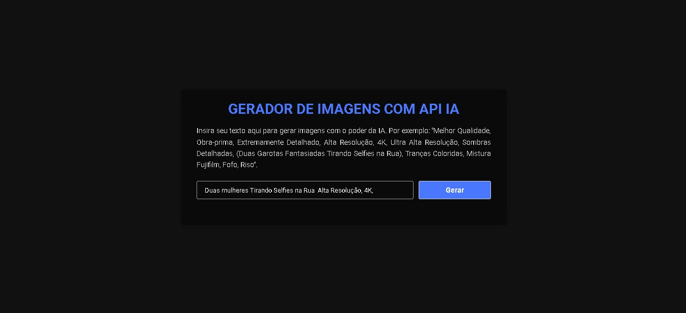
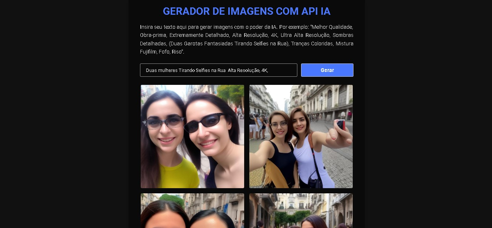

# Gerador de Imagens com IA

Bem-vindo ao Gerador de Imagens com IA! Este é um aplicativo gratuito que utiliza a API da Hugging Face para criar imagens geradas por inteligência artificial. Siga as instruções abaixo para configurar sua própria chave de API e começar a gerar imagens incríveis.

## Captura de Tela

Aqui está uma captura de tela do projeto:




## Como Configurar Sua Chave de API

Para usar o aplicativo, você precisa obter sua própria chave de API da Hugging Face e substituí-la no arquivo `js/script.js`. Siga os passos abaixo para conseguir sua chave:

### Passo 1: Acesse o Site da Hugging Face

Vá para o site da Hugging Face em [https://huggingface.co/](https://huggingface.co/).

### Passo 2: Crie uma Conta

Se você ainda não tiver uma conta, clique em "Sign Up" para criar uma nova conta. Siga as instruções para preencher as informações necessárias.

### Passo 3: Faça Login

Após criar sua conta, faça login no site da Hugging Face com suas credenciais.

### Passo 4: Acesse Suas Configurações

No canto superior direito da página, clique no ícone do seu perfil e selecione "Settings" (Configurações).

### Passo 5: Obtenha Sua Chave de API

Nas configurações, role para baixo até encontrar a seção "API Key" (Chave de API). Clique em "Create New API Key" (Criar Nova Chave de API).

Uma nova chave de API será gerada. Copie essa chave.

### Passo 6: Substitua a Chave no Script

Agora, cole a chave de API que você copiou no arquivo `js/script.js` na linha 1, onde está escrito:

```javascript
const apiKey = "SUA_API_KEY";
```

### Passo 7: Salve as Alterações

Depois de colar a chave de API, salve as alterações no arquivo `js/script.js`.

Agora você tem sua própria chave de API configurada e está pronto para usar este aplicativo de geração de imagens com IA!

